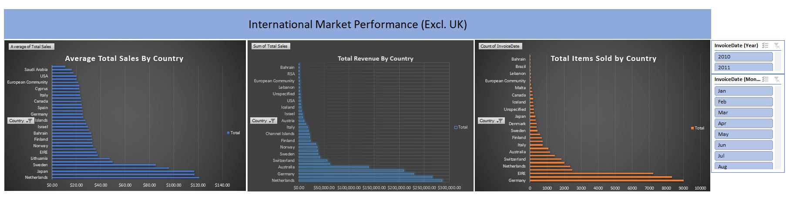

#  International Market Performance Dashboard (Excl. UK)

*(Note: Replace 'dashboard_screenshot.png' with your actual image filename)*

##  Project Overview
This project analyzes a dataset of over **500,000 retail transactions** from a UK-based online wholesaler. The goal was to transform raw transaction logs into a dynamic **Operational Dashboard** to track international export performance, identify high-growth foreign markets, and optimize logistics strategy.

**Business Context:**
As an analyst, I needed to isolate international sales from domestic (UK) data to answer three critical questions:
1.  **Revenue Leaders:** Which countries generate the most total income?
2.  **Market Efficiency:** Which countries have the highest "Average Order Value" (AOV)?
3.  **Volume vs. Value:** Which markets buy frequently versus those that buy in bulk?

---

##  Tools & Skills Used
* **Microsoft Excel (Advanced)**
* **Data Cleaning:** Power Query & Filter Logic (Excluding "United Kingdom")
* **Formulas:** `SUMIF`, `AVERAGEIF`, Text Functions (`TEXT`, `YEAR`)
* **Pivot Tables & Charts:** Dynamic aggregations for Revenue, Volume, and Averages
* **Dashboarding:** Slicers, Timelines, and Interactive Reporting

---

##  The Process

### 1. Data Cleaning (The "Messy" Part)
The raw dataset contained over 500k rows with significant noise. I performed the following cleaning steps to ensure accuracy:
* **Handling Returns:** Identified and filtered out invoices starting with "C" (Cancellations) which caused negative revenue errors.
* **Missing Data:** Filtered out rows with missing `CustomerID` to focus on verified member transactions.
* **Date Formatting:** Converted raw text date strings into valid Excel Date formats for time-series analysis.
* **Duplicate Removal:** Checked for and removed duplicate transaction entries.

### 2. Data Processing (Formulas)
I engineered new features to enable deeper analysis:
* **Total Revenue:** Created a calculation column: `=Quantity * UnitPrice`.
* **Time Extraction:** Extracted Month and Year using `=TEXT([@Date], "mmmm")` to analyze seasonality.
* **Region Segmentation:** Applied logic to **exclude "United Kingdom"** to focus entirely on export performance.

### 3. Analysis & Visualization (Pivot Tables)
I built three core analysis modules:
* **Total Revenue By Country:** A bar chart identifying the top revenue-generating markets (Netherlands, EIRE, Germany).
* **Average Sales By Country:** A metric to identify high-value customers (Australia, Japan, Netherlands).
* **Transaction Volume:** A breakdown of order frequency to understand market activity.

---

## ⚠️ Note on Data Size
The full analysis was performed on a dataset with **581,472 rows**. 
Due to GitHub's file size limits, the uploaded Excel file (`Online_Retail_Portfolio_Version.xlsx`) is a **truncated sample (top 5,000 rows)** to demonstrate the formulas and dashboard structure.
##  Dashboard Features
The final Excel file contains a fully interactive **Management Dashboard**:
* **Slicers:** Allows users to instantly filter data by **Year** (2010 vs 2011) and **Month**.
* **Timeline Slider:** Specific quarters can be selected to drill down into seasonal peaks.
* **KPI Cards:** Dynamic cells showing Total Revenue, Total Orders, and Average Order Value at a glance.

---

##  Key Business Insights
1.  **The "Netherlands" Opportunity:** The Netherlands ranks **#1 in Total Revenue** AND **#1 in Average Order Value**. It is the most valuable export market and should be prioritized for inventory allocation.
2.  **Germany vs. Australia Strategy:**
    * **Germany:** High volume, lower average spend. Strategy: Focus on upsells.
    * **Australia:** Low volume, extremely high average spend (~$115/order). Strategy: Focus on bulk shipping efficiency.
3.  **EIRE (Ireland) Stability:** Ireland remains a consistent top performer in total revenue, likely due to geographic proximity.

---

##  How to View
1.  Download the file: `[Online_Retail_International.xlsx]` (Link to your file).
2.  Open in Microsoft Excel.
3.  Interact with the **Slicers** on the "Dashboard" tab to filter by Year and Month.

---

*Author: Mau Kai Hing*
*Data Source: UCI Machine Learning Repository (Online Retail II)*
